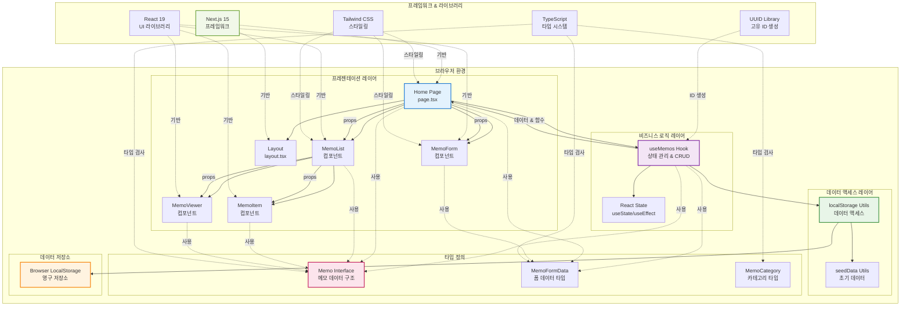

# 메모 앱 시스템 아키텍처

## 개요

이 다이어그램은 Next.js 기반 클라이언트 사이드 메모 애플리케이션의 전체 시스템 아키텍처를 보여줍니다. 이 앱은 브라우저의 LocalStorage를 사용하여 데이터를 저장하는 단일 페이지 애플리케이션입니다.

## 시스템 아키텍처 다이어그램

## 아키텍처 설명

### 1. 프레젠테이션 레이어
- **Home Page**: 애플리케이션의 메인 페이지, 모든 컴포넌트를 조합
- **MemoList**: 메모 목록 표시, 검색 및 필터링 기능
- **MemoForm**: 메모 생성/편집을 위한 모달 폼
- **MemoItem**: 개별 메모 카드 컴포넌트
- **MemoViewer**: 메모 상세 보기 모달
- **Layout**: 애플리케이션 전체 레이아웃

### 2. 비즈니스 로직 레이어
- **useMemos Hook**: 메모 관련 모든 비즈니스 로직 관리
  - CRUD 작업 (생성, 읽기, 업데이트, 삭제)
  - 검색 및 필터링
  - 통계 계산
- **React State**: 컴포넌트 상태 관리

### 3. 데이터 액세스 레이어
- **localStorage Utils**: LocalStorage와의 모든 상호작용 추상화
- **seedData Utils**: 애플리케이션 초기 실행 시 샘플 데이터 제공

### 4. 타입 정의
- **Memo Interface**: 메모 데이터의 구조 정의
- **MemoFormData**: 폼 데이터의 타입 정의
- **MemoCategory**: 메모 카테고리 타입 정의

### 5. 데이터 저장소
- **Browser LocalStorage**: 클라이언트 사이드에서 메모 데이터 영구 저장

### 6. 프레임워크 & 라이브러리
- **Next.js 15**: React 기반 풀스택 프레임워크
- **React 19**: UI 컴포넌트 라이브러리
- **TypeScript**: 정적 타입 검사
- **Tailwind CSS**: 유틸리티 우선 CSS 프레임워크
- **UUID**: 고유 식별자 생성

## 데이터 플로우

1. 사용자가 UI를 통해 액션 수행
2. 컴포넌트에서 useMemos 훅의 함수 호출
3. useMemos에서 비즈니스 로직 처리
4. localStorage Utils를 통해 데이터 저장/조회
5. LocalStorage에 데이터 영구 저장
6. 상태 업데이트로 UI 리렌더링

## 특징

- **클라이언트 사이드 전용**: 백엔드 서버 없이 동작
- **오프라인 지원**: LocalStorage 사용으로 오프라인에서도 데이터 유지
- **모듈화된 구조**: 각 레이어별로 명확한 책임 분리
- **타입 안전성**: TypeScript를 통한 컴파일 타임 타입 검사
- **반응형 UI**: Tailwind CSS를 활용한 반응형 디자인

## 확장 가능성

향후 백엔드 API 연동 시에는 localStorage Utils를 API 호출 로직으로 교체하는 것만으로도 쉽게 확장 가능한 구조입니다.